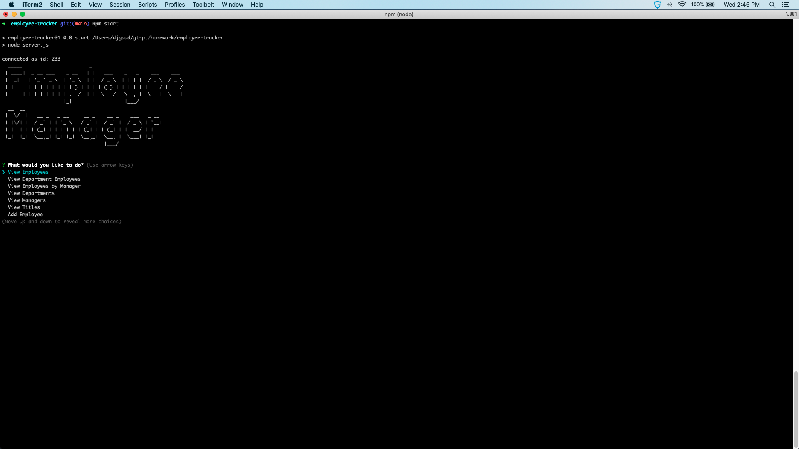

# Employee Tracker CLI Application

## Summary

CLI application for managing employees. Provides the ability view, add and update employees as well as removing employees and changing their titles and manager

## Application Screenshot

## Application Demo

https://youtu.be/bGDRVGsK074

## Technologies Used

NodeJS, mySQL, Inquirer, NPM, Figlet, As-Table

## Installation

copy repository to local drive. Open terminal. Navigate to directory. run npm install to install all dependencies. Run npm start from terminal to run program

## Usage

Once the program is running you will be able to perform employee maintenance by using the menu

## Credits

NodeJS devs
mySQL npm devs
Inquirer npm devs
Npm devs
Figlet devs
as-Table devs

## License

Licensed under the [MIT](LICENSE) license
